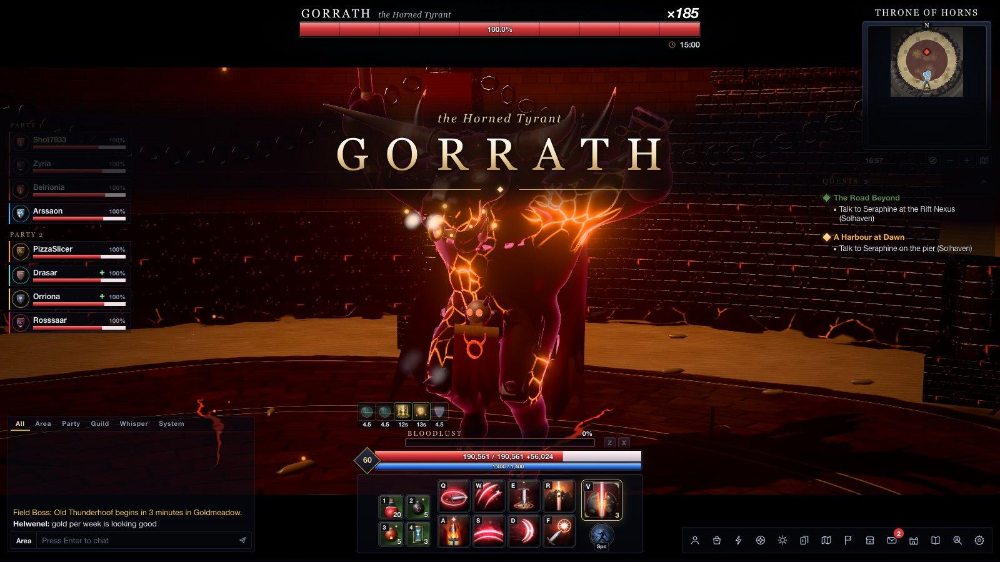

<div align="center">

# SEVENSHARD — *The Sundered Light*

**A Lost Ark–inspired isometric action MMO that runs in one browser tab.**
Eight classes, chaos dungeons, guardian raids, a two-gate legion raid, sailing, islands, honing, engravings and
friends in the same world, all in a single HTML file.

### ▶ [Play now](https://alexmorrison12.github.io/sevenshard/) · no install, no account



</div>

Everything you see and hear is generated in code at runtime. That covers the 3D models, animation rigs, terrain,
textures, spell effects, 900+ icons, the orchestral score and every sound effect. The repository contains no image,
model or audio files. `node build.mjs` bundles the whole game into one ~4 MB HTML page (≈1.2 MB gzipped).

## What's in it

| | |
|---|---|
| **Classes** | Reaver (greatsword), Oathkeeper (sword & shield support), Stormfist (gauntlets), Pistoleer (pistols), Starcaller (staff), Songweaver (harp support), Bladedancer (twin blades), Demonbound (glaive). Each class has 12 skills, 3 tiers of tripods, an identity gauge, an awakening and class engravings. |
| **Combat** | QWER/ASDF skills (normal, combo, chain, holding, charge with a perfect zone, casting, point), dash and stand-up, counters on blue glows, stagger checks, weak points, back and head attacks, super armor, knockdowns, battle items, a damage meter |
| **Content** | Demon Rift chaos dungeons (3 stages, rift crystals, rest bonus) · Guardian Hunts: Rimewing, Cinderhorn, Sandmaw, Kurai the Pyrefox · The Sunken Oratory abyssal dungeon · **Gorrath, the Horned Tyrant** legion raid with gates, hard mode, weekly gold, bidding and More Rewards · Inferno Descent (100 floors) · Rift Cube · Trial Guardian · Proving Grounds 3v3 · field bosses, chaos gates and Adventure Islands on a live schedule |
| **World** | The prologue siege of Brighthold · Solhaven, a capital that follows your clock (day, dusk and night) · Goldmeadow, Thornwood, Ashen Ridge · Pipsprout Hollow, where you shrink to Pip size · the Glass Sea with your own ship, crew and islands · Brightwater Isle stronghold |
| **Progression** | Honing with Artisan's Energy and Solar boosters · quality · gear sets · accessories · ability-stone faceting · engravings · gems · cards · the Sunheart Passive · Adventure Tome, Pip Seeds and collectibles · rapport, songs and emotes · Wayfarer's Tasks |
| **MMO layer** | A roster of up to 6 characters · a town full of AI adventurers who chat in Lost Ark culture, form parties, bid on loot and join your raids · party finder · guilds, market and mail · leaderboards, share cards and challenge links · **Watch the Raid**, an 8-AI spectator mode |
| **Multiplayer** | Host a world and share a link. Up to 8 friends play together over WebRTC: they follow you into every dungeon and raid, and each browser runs its own hero. |

## Controls

| | Keyboard & mouse | Gamepad | Touch |
|---|---|---|---|
| Move | Right-click (or left, in Settings) | Left stick | Floating stick |
| Basic attack · Skills | C · Q W E R / A S D F | Buttons | Tap · skill cluster (auto-aim) |
| Identity · Awakening | Z / X · V | | Z / X · V |
| Dash · Interact | Space · G | | Dash button |
| Battle items | 1 – 4 | | Item buttons |
| Mount · Songs · Emotes | T · B · . | | |
| Windows | P character · I inventory · K skills · N engravings · M map · J quests · L tome · H event compass · O party finder · U guild · Y meter · Esc menu | | Menu button |

## Playing with friends

1. Choose **Play Together → Host** on the title screen (or **Game Menu → Host** in the world).
2. Send the invite link. Friends who open it join your world with their own characters.
3. Walk into a portal and your party comes with you. Enemies are simulated on the host; each player's hero is simulated
   in their own browser.

Signalling goes through the free public PeerJS service. Gameplay traffic then goes directly browser to browser, and
nothing runs on a server of ours.

## Built with

- **three.js r186 / WebGL2.** HDR scene, bloom, Khronos neutral tone mapping and a per-zone colour grade. Skinned
  models are SDF-sculpted in code, the terrain is a splat-mapped heightfield, and the particle, ribbon, decal and
  damage-number systems are all GPU-side.
- **WebAudio.** A synthesized score for each place, 125 sound effects, stingers, ambience and in-world songs.
- **esbuild.** A single-file build; the site is one `index.html`.
- **PeerJS.** WebRTC data channels for co-op.

## Development

```bash
npm ci
node build.mjs            # → dist/index.html (add --min for the release build)
node tools/serve.mjs dist 5299
```

Open http://localhost:5299. URL switches: `?watch=1` / `?watch=2` (spectate a raid gate), `?join=<room>` (join a
friend), and for development `?dev=chaos`, `?dev=boss&boss=<id>`, `?dev=arena`.

Test tooling (headless Chrome via puppeteer-core):

| Tool | What it does |
|---|---|
| `tools/e2e.mjs` | Launch gate. Plays story creation, a Powerpass character, windows, skills, vendor, mount, emotes, party finder, a full chaos dungeon, a guardian and a raid gate, then checks the save. Fails on any console error. |
| `tools/coopflow.mjs` | Two browsers: host in Solhaven, guest joins by link, both enter a dungeon and fight |
| `tools/windows.mjs` | Opens every window, screenshots each one and reports errors |
| `tools/seq.mjs` | Frame-sequence capture of any fight, for visual QA |
| `tools/mobile.mjs` | Phone-landscape pass with touch emulation |
| `tools/classes.mjs` | Runs every skill of every class and reports runtime errors |

Design notes live in [DESIGN.md](DESIGN.md) and [ARCHITECTURE.md](ARCHITECTURE.md). [FEATURES.md](FEATURES.md) maps
every Lost Ark system to its SEVENSHARD counterpart.

## Credits & disclaimer

SEVENSHARD is a non-commercial fan project inspired by *Lost Ark*. It is not affiliated with, endorsed by or connected to
Smilegate RPG or Amazon Games. *Lost Ark* is a trademark of Smilegate RPG. All names, characters, places, story, art,
music and code here are original.

Made with [Claude Code](https://claude.com/claude-code).
